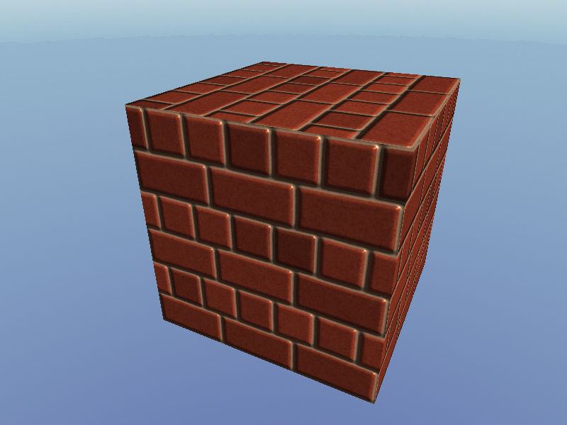
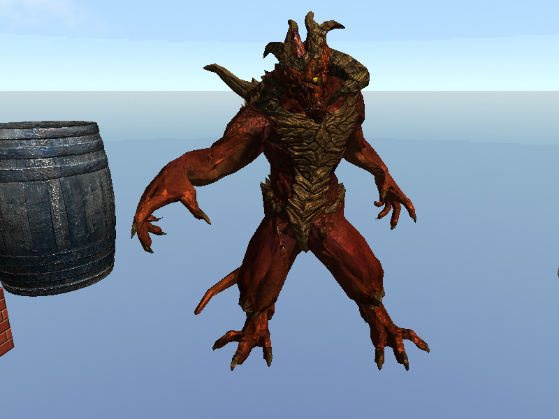

# Javascript Software Renderer

3D Software rendering in HTML canvas with Javascript.  
This program is written in vanilla javascript. No WebGL, No library used.

Video: https://youtu.be/EGpyw_Su2r0  
Live Demo: https://sopiro.github.io/SoftwareRenderer/

## Preview 

|Post Processing Enabled|Normal Mapping|
|--|--|
|||

|||
|--|--|
|||
|||
|||

## Implemented Features
- Point drawing
- Line drawing
- Triangle rasterization
  - A Parallel Algorithm for Polygon Rasterization. Juan Pineda. Siggraph 1988.
  - [Explained](https://www.scratchapixel.com/lessons/3d-basic-rendering/rasterization-practical-implementation/rasterization-stage)
- Indexed vertex rendering
- Depth buffering
- Line, Polygon clipping
- Model transform, Camera transform
- Perspective projection
- Back face culling
- Perspective-correct vertex attribute interpolation
- Texture mapping
- Skybox
- OBJ model loading
  - Calculating face normal, tangent vectors
- Vertex, Pixel shading
- Phong shading
- Normal mapping
- Directional light
- Resolution changer
- Post-processing stage
