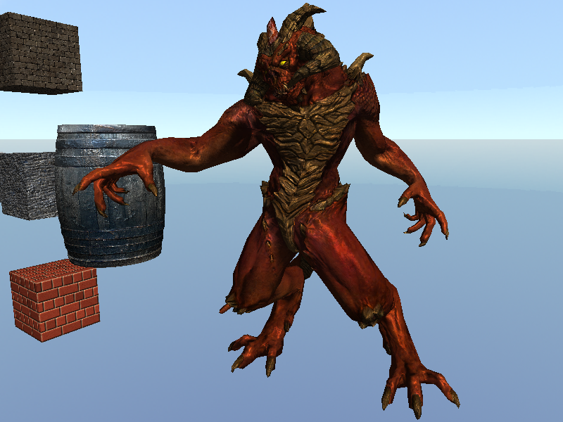

# Software Renderer

This is a 3D Software renderer implemented in HTML canvas using vanilla javascript.  
No WebGL, No external library used!

Live Demo: https://sopiro.github.io/SoftwareRenderer/  
Video: https://youtu.be/EGpyw_Su2r0  

## Examples

|Post processing effects|Normal mapping|
|--|--|
|||

|Line and triangle| Flat and smooth shaded spheres|
|--|--|
| ||

|Normal mapped cube 1| Normal mapped cube 2|
|--|--|
|||

|Normal mapped barrel| Textured cubes and Blender Suzanne|
|--|--|
|||

|Diablo model with normal mapping| Diablo model without normal mapping|
|--|--|
|||

## Features
- Point and line rendering
- Triangle rasterization
  - [Paper](https://dl.acm.org/doi/10.1145/54852.378457) [Scratchapixel](https://www.scratchapixel.com/lessons/3d-basic-rendering/rasterization-practical-implementation/rasterization-stage)
- Perspective-correct vertex attribute interpolation
- Depth buffering
- Clipping for near plane
- Back face culling
- Indexed mesh rendering
- Texture mapping
- OBJ model loading
  - Calculating face normal and tangent vectors
- Vertex and fragment shading
- Perspective projection, viewport transform
- Phong shading model
  - Directional light
- Normal mapping
- Post-processing stage
- Skybox
